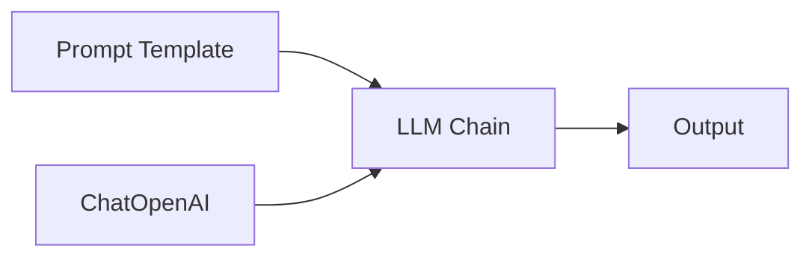
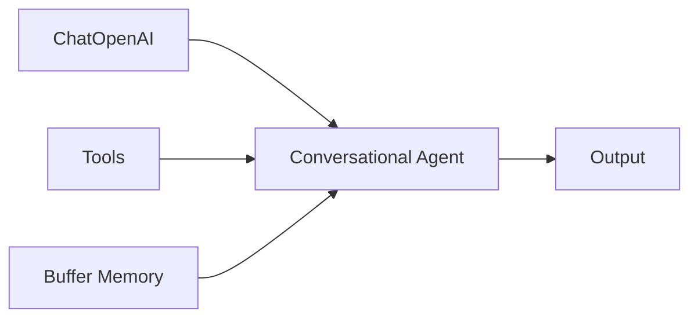
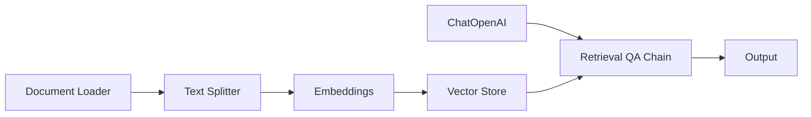

Chatflows are visual workflows that connect AI models, tools, and logic to create intelligent applications. This guide walks you through creating your first chatflow.

## Understanding Chatflows

A chatflow is a visual representation of how data flows through different nodes:

- **Nodes**: Individual components (LLMs, tools, memory, etc.)
- **Edges**: Connections between nodes that define data flow
- **Canvas**: The visual workspace where you build your flow

## Creating a New Chatflow

<Steps>
  <Step title="Navigate to Chatflows">
    Click on **Chatflows** in the main navigation to view all your chatflows.
  </Step>
  
  <Step title="Start a New Flow">
    Click the **Add New** button to create a blank chatflow, or choose from templates in the marketplace.
  </Step>
  
  <Step title="Name Your Chatflow">
    Click the chatflow name in the header to edit it. Choose a descriptive name like "Customer Support Bot" or "Document QA".
  </Step>
</Steps>

## Building Your First Flow

Let's create a simple conversational chatbot:

<Steps>
  <Step title="Add a Language Model">
    1. Click the **+ Add Node** button
    2. Navigate to **Chat Models**
    3. Select **ChatOpenAI**
    4. Configure your API credentials
    5. Set model parameters (temperature, max tokens, etc.)
  </Step>
  
  <Step title="Add Memory">
    Memory enables your chatbot to remember conversation history:
    
    1. Click **+ Add Node**
    2. Go to **Memory** category
    3. Select **Buffer Memory**
    4. Configure session settings (optional)
  </Step>
  
  <Step title="Add the Chain">
    The chain connects everything together:
    
    1. Click **+ Add Node**
    2. Go to **Chains** category  
    3. Select **Conversation Chain**
    4. This node will have input anchors for the LLM and memory
  </Step>
  
  <Step title="Connect the Nodes">
    Draw connections between nodes:
    
    1. Click and drag from **ChatOpenAI** output to **Conversation Chain** model input
    2. Connect **Buffer Memory** output to **Conversation Chain** memory input
    3. Connections appear as lines between nodes
  </Step>
</Steps>

<Note>
  Output anchors are on the right side of nodes, input anchors on the left. Flowise validates connections to ensure compatible types.
</Note>

## Working with Templates

Flowise provides pre-built templates for common use cases:

<Tabs>
  <Tab title="Using Templates">
    1. Go to **Marketplace** in the navigation
    2. Browse available chatflow templates
    3. Click **Use Template** on any flow
    4. The template opens in a new canvas
    5. Customize nodes and connections as needed
    6. Save your customized version
  </Tab>
  
  <Tab title="Popular Templates">
    - **Conversational Agent**: LLM with tools and memory
    - **Conversational Retrieval QA Chain**: RAG with conversation history
    - **LLM Chain**: Basic stateless prompt → LLM flow
    - **Simple Chat Engine**: LlamaIndex-based chat
    - **SQL DB Chain**: Natural language to SQL queries
  </Tab>
</Tabs>

## Canvas Controls

The canvas provides several controls for navigation and organization:

| Control | Description |
|---------|-------------|
| **Zoom In/Out** | Use mouse wheel or zoom controls |
| **Pan** | Click and drag on empty canvas area |
| **Fit View** | Auto-fit all nodes into view |
| **Snap to Grid** | Toggle grid snapping with magnet icon |
| **Background** | Toggle grid background visibility |
| **Mini Map** | Overview of entire flow (on large flows) |

## Configuring Chatflow Settings

<Accordion title="Chatflow Configuration Options">
  Access via the settings icon in the header:
  
  - **Category**: Organize chatflows by category
  - **Tags**: Add searchable tags
  - **Session Settings**: Configure session timeout and behavior
  - **Rate Limiting**: Set request limits per user/session
  - **Speech to Text**: Enable voice input
  - **Follow Up Prompts**: Auto-generate suggested questions
  - **Security**: Configure allowed domains and authentication
</Accordion>

## Saving and Deploying

<Steps>
  <Step title="Save Your Flow">
    Click the **Save** button in the header. The flow is auto-saved to the database.
    
    <Warning>
      Unsaved changes are marked with a dirty indicator. You'll be prompted before navigating away.
    </Warning>
  </Step>
  
  <Step title="Test Your Flow">
    Click the **Chat** button to open the test interface. Send messages to verify behavior before deploying.
  </Step>
  
  <Step title="Deploy">
    Toggle the **Deploy** switch in the chatflows list. Deployed flows are accessible via API and embedded chat.
  </Step>
</Steps>

## Common Patterns

### Basic LLM Chain

Use for: Stateless prompt completion, text generation, classification

### Conversational Agent

Use for: Chatbots with tool access, multi-step reasoning, dynamic actions

### RAG (Retrieval Augmented Generation)

Use for: Document Q&A, knowledge bases, semantic search

## Best Practices

<Accordion title="Organizing Complex Flows">
  - Use **Sticky Notes** to add comments and documentation
  - Group related nodes together visually
  - Use consistent naming conventions
  - Keep flows under 15-20 nodes when possible
  - Break complex logic into multiple chatflows
</Accordion>

<Accordion title="Performance Optimization">
  - Use appropriate model sizes (don't default to largest)
  - Configure reasonable token limits
  - Implement caching for embeddings and LLM responses
  - Use streaming for better perceived performance
</Accordion>

<Accordion title="Security Considerations">
  - Store API keys in credentials, not hardcoded
  - Configure input moderation for user-facing bots
  - Set rate limits to prevent abuse
  - Use allowed domains to restrict access
  - Review system prompts for prompt injection risks
</Accordion>

## Next Steps

<CardGroup cols={2}>
  <Card title="Working with Nodes" icon="cube" href="/building/working-with-nodes">
    Learn about different node types and configurations
  </Card>
  
  <Card title="Testing & Debugging" icon="bug" href="/building/testing-debugging">
    Debug and optimize your chatflows
  </Card>
  
  <Card title="Variables & Expressions" icon="code" href="/building/variables-expressions">
    Use dynamic values and expressions
  </Card>
  
  <Card title="Deployment" icon="rocket" href="/deployment/overview">
    Deploy your chatflow to production
  </Card>
</CardGroup>
