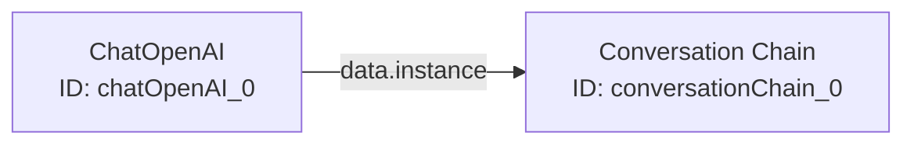

Variables and expressions enable dynamic, reusable chatflows by injecting runtime values into your nodes. This guide covers global variables, node references, and expression syntax.

## Overview

Flowise supports three types of dynamic values:

1. **Global Variables**: Reusable values defined once, used everywhere
2. **Node References**: Output from one node used as input to another
3. **Runtime Variables**: User input and system-provided values

## Global Variables

Global variables let you define values once and reference them across chatflows.

### Creating Variables

<Steps>
  <Step title="Navigate to Variables">
    Click **Variables** in the main navigation to open the variables management page.
  </Step>
  
  <Step title="Add New Variable">
    Click **Add Variable** to create a new variable:
    
    - **Name**: Unique identifier (e.g., `apiKey`, `personality`, `companyName`)
    - **Type**: Static or Runtime
    - **Value**: The variable's value
  </Step>
  
  <Step title="Configure Variable Type">
    <Tabs>
      <Tab title="Static Variables">
        Values stored directly in Flowise:
        
        ```yaml
        Name: companyName
        Type: Static
        Value: Acme Corporation
        ```
        
        Use for:
        - Company information
        - Prompt templates
        - Configuration values
        - Non-sensitive constants
      </Tab>
      
      <Tab title="Runtime Variables">
        Values loaded from environment variables (`.env` file):
        
        ```yaml
        Name: openaiApiKey
        Type: Runtime
        Value: OPENAI_API_KEY  # References process.env.OPENAI_API_KEY
        ```
        
        Use for:
        - API keys
        - Secrets
        - Environment-specific values
        - Deployment configurations
      </Tab>
    </Tabs>
  </Step>
</Steps>

<Warning>
  Never store sensitive values (API keys, passwords) as Static variables. Always use Runtime variables with environment variables.
</Warning>

### Using Variables in Nodes

Reference variables in any text field using the `$vars` syntax:

<Tabs>
  <Tab title="In Prompts">
    Use double curly braces in text fields:
    
    ```
    You are a {{$vars.personality}} AI assistant representing {{$vars.companyName}}.
    
    Your role is to help customers with {{$vars.supportScope}}.
    ```
    
    At runtime, Flowise replaces these with actual values:
    
    ```
    You are a friendly and professional AI assistant representing Acme Corporation.
    
    Your role is to help customers with product questions and troubleshooting.
    ```
  </Tab>
  
  <Tab title="In Custom Functions">
    Access variables directly in code:
    
    ```javascript
    // Custom Tool Example
    const apiKey = $vars.myApiKey
    const baseUrl = $vars.apiBaseUrl
    
    const response = await fetch(`${baseUrl}/endpoint`, {
      headers: {
        'Authorization': `Bearer ${apiKey}`
      }
    })
    
    return await response.json()
    ```
  </Tab>
  
  <Tab title="In JSON Parameters">
    Use in JSON fields with proper escaping:
    
    ```json
    {
      "model": "{{$vars.defaultModel}}",
      "temperature": "{{$vars.temperature}}",
      "metadata": {
        "user": "{{$vars.currentUser}}",
        "env": "{{$vars.environment}}"
      }
    }
    ```
  </Tab>
</Tabs>

### Variable Syntax Reference

| Syntax | Description | Example |
|--------|-------------|----------|
| `{{$vars.name}}` | In text fields (prompts, messages) | `Hello {{$vars.userName}}` |
| `$vars.name` | In code (custom tools, functions) | `const key = $vars.apiKey` |
| `$vars.<name>` | Dot notation for variable access | `$vars.config.timeout` |

## Node References

Connect nodes by referencing outputs in other node inputs.

### Understanding Node Data Flow

When you connect nodes visually, Flowise generates reference expressions:



The connection creates this reference:
```javascript
{{chatOpenAI_0.data.instance}}
```

### Reference Syntax

<Accordion title="Node Instance Reference">
  Access the node's output instance:
  
  ```javascript
  {{nodeId.data.instance}}
  ```
  
  **Example**:
  ```javascript
  // Reference ChatOpenAI model in Conversation Chain
  {{chatOpenAI_0.data.instance}}
  
  // Reference vector store in Retrieval QA Chain
  {{pinecone_0.data.instance}}
  
  // Reference tool in Agent
  {{calculator_0.data.instance}}
  ```
  
  <Note>
    Visual connections automatically create these references. You rarely need to write them manually.
  </Note>
</Accordion>

<Accordion title="Node Input/Output Data">
  Access specific data from node configuration:
  
  ```javascript
  {{nodeId.data.inputs.parameterName}}
  ```
  
  **Example**:
  ```javascript
  // Get the model name from ChatOpenAI node
  {{chatOpenAI_0.data.inputs.modelName}}
  // Result: "gpt-4"
  
  // Get prompt template from Prompt node
  {{promptTemplate_0.data.inputs.template}}
  // Result: "What is a good name for {product}?"
  ```
</Accordion>

<Accordion title="List References (Multiple Connections)">
  When a node accepts multiple inputs (e.g., tools for agents):
  
  ```javascript
  [
    "{{calculator_0.data.instance}}",
    "{{serpAPI_0.data.instance}}",
    "{{weather_0.data.instance}}"
  ]
  ```
  
  Flowise automatically manages list inputs when you connect multiple nodes to a single anchor.
</Accordion>

## Runtime Variables

Variables provided automatically during execution.

### User Input Variables

<Tabs>
  <Tab title="Question Variable">
    The user's current message:
    
    ```javascript
    {{question}}
    ```
    
    **Example in Prompt**:
    ```
    User Question: {{question}}
    
    Please provide a detailed answer based on the following context...
    ```
    
    **Example in Custom Function**:
    ```javascript
    const userInput = $question  // Direct access in code
    const processed = userInput.toLowerCase().trim()
    return processed
    ```
  </Tab>
  
  <Tab title="Chat History Variable">
    Previous conversation messages (when using memory):
    
    ```javascript
    {{chat_history}}
    ```
    
    **Format**:
    ```
    Human: Hello!
    AI: Hi there! How can I help you?
    Human: What's the weather?
    AI: I'll check the weather for you.
    ```
    
    <Note>
      The memory key must match (default is `chat_history`). Configure in memory node settings.
    </Note>
  </Tab>
  
  <Tab title="Session Variables">
    Session and user metadata:
    
    ```javascript
    {{sessionId}}  // Current session ID
    {{chatId}}     // Chat conversation ID
    ```
    
    **Example in Logging**:
    ```javascript
    // Custom function for analytics
    const logData = {
      session: $sessionId,
      chat: $chatId,
      question: $question,
      timestamp: new Date().toISOString()
    }
    
    await logToAnalytics(logData)
    ```
  </Tab>
</Tabs>

## Override Variables via API

Dynamically set variable values when calling the prediction API:

<Steps>
  <Step title="Define Variables in Flowise">
    Create variables as usual (e.g., `userName`, `language`, `context`).
  </Step>
  
  <Step title="Reference in Chatflow">
    Use variables in your nodes:
    
    ```
    Hello {{$vars.userName}}! I'll respond in {{$vars.language}}.
    ```
  </Step>
  
  <Step title="Override via API">
    Send custom values in the API request:
    
    ```javascript
    const response = await fetch('https://flowise.com/api/v1/prediction/flowId', {
      method: 'POST',
      headers: { 'Content-Type': 'application/json' },
      body: JSON.stringify({
        question: "What's the weather?",
        overrideConfig: {
          vars: {
            userName: "Alice",
            language: "Spanish",
            context: "weather_app"
          }
        }
      })
    })
    ```
  </Step>
  
  <Step title="Result">
    The chatflow uses overridden values:
    
    ```
    Hello Alice! I'll respond in Spanish.
    ```
  </Step>
</Steps>

<Accordion title="Override Config Options">
  Beyond variables, you can override other settings:
  
  ```javascript
  {
    "question": "User input",
    "overrideConfig": {
      // Variable overrides
      "vars": {
        "customVar": "value"
      },
      
      // Session management
      "sessionId": "user-123",
      
      // Model parameters
      "temperature": 0.3,
      "maxTokens": 1000,
      
      // RAG settings
      "returnSourceDocuments": true,
      "topK": 5,
      
      // Streaming
      "streaming": true
    }
  }
  ```
</Accordion>

## Advanced Patterns

### Conditional Logic with Variables

Use variables in conditional expressions (requires custom code nodes):

```javascript
// In Custom Function node
const userTier = $vars.userTier  // "free", "pro", "enterprise"
const question = $question

if (userTier === "free") {
  return "Upgrade to Pro for this feature!"
} else if (userTier === "pro") {
  // Limited functionality
  return await basicAnalysis(question)
} else {
  // Full functionality
  return await advancedAnalysis(question)
}
```

### Multi-Environment Configuration

Use variables for environment-specific settings:

<Tabs>
  <Tab title="Development">
    `.env.development`:
    ```bash
    OPENAI_MODEL=gpt-3.5-turbo
    VECTOR_STORE_URL=http://localhost:6333
    DEBUG_MODE=true
    ```
    
    Variables:
    ```yaml
    defaultModel: Runtime -> OPENAI_MODEL
    vectorStoreUrl: Runtime -> VECTOR_STORE_URL
    debugMode: Runtime -> DEBUG_MODE
    ```
  </Tab>
  
  <Tab title="Production">
    `.env.production`:
    ```bash
    OPENAI_MODEL=gpt-4
    VECTOR_STORE_URL=https://vectordb.example.com
    DEBUG_MODE=false
    ```
    
    Same variables, different values loaded automatically based on environment.
  </Tab>
</Tabs>

### Templated System Messages

Create reusable personality templates:

```
You are {{$vars.botPersonality}}, an AI assistant for {{$vars.companyName}}.

Your expertise: {{$vars.expertiseArea}}

Tone: {{$vars.communicationTone}}

Constraints:
- {{$vars.constraint1}}
- {{$vars.constraint2}}

Current context: {{$vars.contextInfo}}
```

Set different values per deployment or user segment.

### Dynamic Prompt Templates

Build prompts from variable components:

<Steps>
  <Step title="Define Prompt Parts as Variables">
    ```yaml
    Variables:
      - promptPrefix: "You are a helpful assistant."
      - taskDescription: "Answer questions accurately."
      - outputFormat: "Provide answers in JSON format."
      - constraints: "Keep responses under 100 words."
    ```
  </Step>
  
  <Step title="Compose in Prompt Template">
    ```
    {{$vars.promptPrefix}}
    
    Task: {{$vars.taskDescription}}
    
    Format: {{$vars.outputFormat}}
    
    Constraints: {{$vars.constraints}}
    
    Question: {{question}}
    ```
  </Step>
  
  <Step title="Modify Behavior">
    Change variables to alter chatflow behavior without editing flows:
    
    - A/B test different prompts
    - Personalize per user segment
    - Adjust based on time/context
  </Step>
</Steps>

## Expression Syntax Summary

<Accordion title="Text Field Expressions">
  Use in any text input field (prompts, messages, JSON strings):
  
  ```
  {{expression}}
  ```
  
  **Examples**:
  ```
  {{$vars.variableName}}           # Global variable
  {{nodeId.data.instance}}          # Node reference
  {{question}}                      # User input
  {{chat_history}}                  # Conversation history
  {{nodeId.data.inputs.param}}     # Node configuration value
  ```
</Accordion>

<Accordion title="Code Expressions">
  Use in custom code (tools, functions, loaders):
  
  ```javascript
  $expression
  ```
  
  **Examples**:
  ```javascript
  $vars.variableName          // Global variable
  $question                   // User input
  $sessionId                  // Session ID
  $input                      // Tool input parameter
  $credentials.apiKey         // Credential value
  ```
</Accordion>

<Accordion title="JSON Expressions">
  Use in JSON parameter fields:
  
  ```json
  {
    "key": "{{expression}}"
  }
  ```
  
  **Note**: Always use strings in JSON, even for numbers:
  ```json
  {
    "temperature": "{{$vars.temp}}",  // ✅ String
    "temperature": {{$vars.temp}}     // ❌ Invalid JSON
  }
  ```
</Accordion>

## Best Practices

<Accordion title="Variable Naming">
  - Use camelCase: `apiKey`, `userName`, `defaultModel`
  - Be descriptive: `openaiApiKey` not `key1`
  - Prefix by category: `llm_model`, `llm_temperature`, `db_connectionString`
  - Avoid special characters (stick to letters, numbers, underscore)
</Accordion>

<Accordion title="Security">
  - **Never** store secrets as Static variables
  - Use Runtime variables for all sensitive data
  - Validate user input in custom functions
  - Sanitize variables used in SQL or external APIs
  - Review variable visibility (can users see them?)
</Accordion>

<Accordion title="Organization">
  - Document variables with clear names
  - Group related variables (e.g., `email_*`, `api_*`)
  - Delete unused variables regularly
  - Export/import variables with chatflows for portability
  - Maintain a variable registry for team reference
</Accordion>

<Accordion title="Performance">
  - Cache runtime variable lookups when possible
  - Avoid complex expressions in hot paths
  - Use static variables for constants (faster lookup)
  - Minimize API override vars (smaller payloads)
</Accordion>

## Common Use Cases

<Accordion title="Multi-Tenant SaaS">
  ```javascript
  // Different configs per tenant
  System Message:
  You are an AI assistant for {{$vars.tenantName}}.
  
  Branding: {{$vars.tenantBranding}}
  Features: {{$vars.enabledFeatures}}
  
  // Override via API per tenant
  overrideConfig: {
    vars: {
      tenantName: "Acme Corp",
      tenantBranding: "professional",
      enabledFeatures: "analytics,reports"
    }
  }
  ```
</Accordion>

<Accordion title="Localization">
  ```javascript
  // Support multiple languages
  Variables:
    - greeting_en: "Hello! How can I help you?"
    - greeting_es: "¡Hola! ¿Cómo puedo ayudarte?"
    - greeting_fr: "Bonjour! Comment puis-je vous aider?"
  
  System Message:
  {{$vars.greeting_{{$vars.userLanguage}}}}
  
  // Or use override:
  overrideConfig: {
    vars: {
      userLanguage: "es"
    }
  }
  ```
</Accordion>

<Accordion title="A/B Testing">
  ```javascript
  // Test different prompts
  System Message:
  {{$vars.promptVariant_{{$vars.abTestGroup}}}}
  
  Variables:
    - promptVariant_A: "Friendly assistant version"
    - promptVariant_B: "Professional expert version"
    - promptVariant_C: "Concise advisor version"
  
  // Assign users to groups
  overrideConfig: {
    vars: {
      abTestGroup: "B"  // Randomly assigned per user
    }
  }
  ```
</Accordion>

## Troubleshooting

<Accordion title="Variable Not Resolving">
  **Symptoms**: Seeing `{{$vars.name}}` literally in output
  
  **Causes**:
  - Variable doesn't exist
  - Typo in variable name
  - Wrong syntax (missing `$` or `{{}}`)
  
  **Solutions**:
  1. Check variable exists in Variables page
  2. Verify exact name (case-sensitive)
  3. Use correct syntax: `{{$vars.name}}` in text, `$vars.name` in code
  4. For runtime variables, ensure `.env` file is loaded
</Accordion>

<Accordion title="Node Reference Not Working">
  **Symptoms**: Empty or null values when referencing nodes
  
  **Causes**:
  - Node not connected visually
  - Wrong node ID
  - Node hasn't executed yet
  
  **Solutions**:
  1. Use visual connections instead of manual references
  2. Check node ID in browser console (inspect node data)
  3. Ensure execution order (parent nodes execute first)
</Accordion>

## Next Steps

<CardGroup cols={2}>
  <Card title="API Reference" icon="book" href="/api-reference/overview">
    Learn about overrideConfig and API usage
  </Card>
  
  <Card title="Custom Tools" icon="wrench" href="/tools/custom-tools">
    Build custom tools using variables
  </Card>
  
  <Card title="Deployment" icon="rocket" href="/deployment/overview">
    Environment variables in production
  </Card>
  
  <Card title="Security" icon="shield" href="/security/best-practices">
    Secure variable management
  </Card>
</CardGroup>
