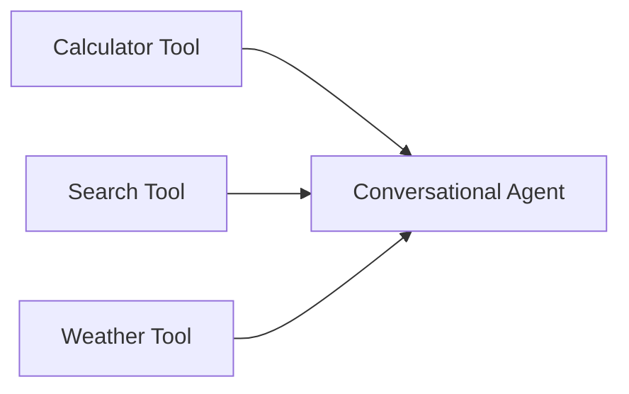

Nodes are the building blocks of chatflows. Each node represents a specific component like an LLM, tool, memory system, or data processor.

## Node Anatomy

Every node has a consistent structure:

```
┌─────────────────────────────┐
│  [Icon] Node Name      [⚠️] │  ← Header with icon and status
├─────────────────────────────┤
│         INPUTS              │  ← Input section
├─────────────────────────────┤
│  ○ Input Anchor 1           │  ← Connection points (left)
│  📝 Parameter 1: [value]    │  ← Configurable parameters
│  📝 Parameter 2: [value]    │
│  [Additional Parameters]    │  ← Advanced settings button
├─────────────────────────────┤
│         OUTPUT              │  ← Output section
├─────────────────────────────┤
│           Output Anchor ○   │  ← Output connection (right)
└─────────────────────────────┘
```

## Node Categories

<Tabs>
  <Tab title="Chat Models">
    Language models that power conversations:
    
    - **ChatOpenAI**: OpenAI's GPT models (3.5, 4, etc.)
    - **ChatAnthropic**: Anthropic's Claude models
    - **ChatOllama**: Local models via Ollama
    - **AzureChatOpenAI**: Azure OpenAI Service
    - **ChatGoogleGenerativeAI**: Google's Gemini models
    
    **Common Parameters**:
    - Model Name: Which model version to use
    - Temperature: Creativity (0 = deterministic, 1 = creative)
    - Max Tokens: Maximum response length
    - Top P: Nucleus sampling parameter
  </Tab>
  
  <Tab title="Chains">
    Orchestrate multiple components together:
    
    - **LLM Chain**: Basic prompt → LLM flow
    - **Conversation Chain**: Chat with memory
    - **Conversational Retrieval QA Chain**: RAG with chat history
    - **API Chain**: Make API calls based on OpenAPI specs
    - **SQL Database Chain**: Natural language to SQL
    
    **When to Use**:
    - Simple, single-purpose workflows
    - Standard patterns with minimal customization
    - Quick prototyping
  </Tab>
  
  <Tab title="Agents">
    Autonomous systems that can use tools and make decisions:
    
    - **Conversational Agent**: Chat-optimized agent with tools
    - **Tool Agent**: Function-calling based agent (recommended)
    - **ReAct Agent**: Reasoning + Acting pattern
    - **OpenAPI Agent**: Interact with APIs dynamically
    - **CSV Agent**: Query and analyze CSV files
    
    **Key Features**:
    - Tool selection and execution
    - Multi-step reasoning
    - Error handling and retries
  </Tab>
  
  <Tab title="Tools">
    Extend agent capabilities with external functions:
    
    - **Calculator**: Perform mathematical calculations
    - **Search API**: Web search (SerpAPI, Serper, etc.)
    - **Webhook**: Make HTTP requests
    - **Custom Tool**: Write your own Python/JavaScript tools
    - **Database Tools**: Query databases
    
    **Tool Configuration**:
    - Name: How the LLM refers to the tool
    - Description: When and how to use it (critical!)
    - Parameters: Input schema for the tool
  </Tab>
  
  <Tab title="Memory">
    Enable chatflows to remember conversation history:
    
    - **Buffer Memory**: Stores recent messages in-memory
    - **Buffer Window Memory**: Last N messages only
    - **Summary Memory**: Summarized conversation history
    - **Vector Store Memory**: Semantic memory retrieval
    - **Agent Memory**: Persistent memory for agents
    
    **Configuration**:
    - Session ID: Group conversations by user/session
    - Memory Key: Variable name in prompts (default: `chat_history`)
    - Return Messages: Return as message objects vs strings
  </Tab>
  
  <Tab title="Vector Stores">
    Store and retrieve embeddings for semantic search:
    
    - **Pinecone**: Managed vector database
    - **Qdrant**: Open-source vector search
    - **Chroma**: Embedded vector database
    - **Postgres**: pgvector extension
    - **In-Memory Vector Store**: Temporary storage
    
    **Setup**:
    1. Choose embedding model (OpenAI, HuggingFace, etc.)
    2. Configure vector store credentials
    3. Upsert documents to populate the store
    4. Connect to retrieval chain or agent
  </Tab>
</Tabs>

## Adding and Configuring Nodes

<Steps>
  <Step title="Open Node Palette">
    Click the **+ Add Node** button on the canvas. This opens the node palette with all available components.
    
    <Note>
      Use the search bar to quickly find nodes by name or category.
    </Note>
  </Step>
  
  <Step title="Select a Node">
    Browse by category or search for a specific node. Click to add it to the canvas.
    
    The node appears at your cursor position. You can also drag-and-drop from the palette.
  </Step>
  
  <Step title="Configure Parameters">
    Click on the node to view its configuration panel:
    
    - **Required parameters** are marked and must be filled
    - **Optional parameters** have default values
    - **Additional Parameters** button reveals advanced settings
    - **Input anchors** accept connections from other nodes
  </Step>
  
  <Step title="Connect to Other Nodes">
    Drag from an output anchor to an input anchor:
    
    1. Click and hold on an output anchor (right side)
    2. Drag to a compatible input anchor (left side)
    3. Release to create the connection
    4. Flowise validates type compatibility automatically
  </Step>
</Steps>

## Node Input Types

Nodes accept different types of inputs:

<Accordion title="Input Anchors (Connections)">
  These are connection points that accept output from other nodes:
  
  - Displayed as circles on the left side of nodes
  - Type-checked (e.g., `BaseChatModel`, `Tool`, `VectorStore`)
  - Can be **single** or **list** (accepting multiple connections)
  - Shows visual feedback on hover (compatible = green, incompatible = red)
  
  **Example**: A Conversational Agent has input anchors for:
  - `model` (BaseChatModel) - single connection
  - `tools` (Tool[]) - list, accepts multiple tools
  - `memory` (BaseChatMemory) - single connection
</Accordion>

<Accordion title="Input Parameters (Direct Values)">
  These are form fields for direct configuration:
  
  **Text Input**: Simple string values
  ```
  System Message: "You are a helpful assistant"
  ```
  
  **Number Input**: Numeric values with validation
  ```
  Temperature: 0.7
  Max Tokens: 2000
  ```
  
  **Select/Dropdown**: Choose from predefined options
  ```
  Model Name: [gpt-4, gpt-3.5-turbo, gpt-4-turbo]
  ```
  
  **JSON Input**: Structured data
  ```json
  {
    "key": "value",
    "nested": { "data": true }
  }
  ```
  
  **Code Editor**: Write custom functions
  ```javascript
  // Custom tool implementation
  const result = await someOperation()
  return result
  ```
  
  **File Upload**: Upload documents, images, or data files
  
  **Credential**: Securely stored API keys and secrets
</Accordion>

<Accordion title="Variable Inputs">
  Parameters that support the `acceptVariable` flag can use dynamic values:
  
  - Reference other node outputs: `{{nodeId.data.instance}}`
  - Use global variables: `{{$vars.variableName}}`
  - Runtime expressions: `{{question}}` (user input)
  
  See [Variables & Expressions](/building/variables-expressions) for details.
</Accordion>

## Node Actions

Hover over a node to reveal action buttons:

| Action | Icon | Description |
|--------|------|-------------|
| **Duplicate** | 📋 | Create a copy of the node with same settings |
| **Delete** | 🗑️ | Remove node and all its connections |
| **Info** | ℹ️ | View node documentation and details |

<Note>
  You can also select nodes and press **Delete** or **Backspace** to remove them.
</Note>

## Advanced Node Features

### Additional Parameters

Many nodes hide advanced settings behind the "Additional Parameters" button:

<Steps>
  <Step title="Open Additional Parameters">
    Click the **Additional Parameters** button at the bottom of the node.
  </Step>
  
  <Step title="Configure Advanced Settings">
    A dialog opens with optional parameters:
    
    - Timeout settings
    - Custom base URLs
    - Advanced model parameters
    - Retry logic
    - Headers and metadata
  </Step>
  
  <Step title="Save Changes">
    Click **Save** to apply the settings. They're stored with the node configuration.
  </Step>
</Steps>

### Credentials

Nodes that require API keys use the credential system:

<Steps>
  <Step title="Create Credential">
    1. Click **Connect Credential** on the node
    2. Select **Create New** from the dropdown
    3. Enter your API key and give it a name
    4. Click **Add**
  </Step>
  
  <Step title="Reuse Credentials">
    Once created, credentials are available across all chatflows:
    
    - Select from the dropdown on any compatible node
    - Update credentials in one place, applies everywhere
    - Credentials are encrypted at rest
  </Step>
</Steps>

<Warning>
  Never hardcode API keys in custom tools or parameters. Always use the credential system.
</Warning>

### Node Versioning

Nodes are versioned to support updates and improvements:

- **Version badge**: Shows current node version (e.g., `v2`, `v3`)
- **Outdated warning**: Orange warning icon if newer version available
- **Sync nodes**: Button appears to upgrade all outdated nodes
- **Breaking changes**: Review changelog before upgrading

<Accordion title="Upgrading Nodes">
  When a sync button appears:
  
  1. Click the **Sync Nodes** button (orange refresh icon)
  2. Flowise automatically updates all outdated nodes
  3. Incompatible connections are removed (review carefully!)
  4. Test your flow after upgrading
  5. Save the updated flow
  
  **Note**: This operation cannot be undone. Export your flow first as backup.
</Accordion>

## Custom Nodes

Flowise allows creating custom nodes for specialized functionality:

<Tabs>
  <Tab title="Custom Tool">
    Write JavaScript/Python functions that agents can call:
    
    ```javascript
    // Custom Tool Example
    // Tool Name: Get Weather
    // Description: Get current weather for a city
    
    const axios = require('axios')
    
    const city = $input // From tool parameter
    const apiKey = $credentials.weatherApiKey
    
    const response = await axios.get(
      `https://api.weather.com/v1/current?city=${city}&key=${apiKey}`
    )
    
    return response.data.temperature
    ```
  </Tab>
  
  <Tab title="Custom Loader">
    Create specialized document loaders:
    
    ```javascript
    // Custom Loader Example
    // Load data from custom API
    
    const fetchData = async () => {
      const response = await fetch('https://api.example.com/data')
      const data = await response.json()
      
      return data.items.map(item => ({
        pageContent: item.text,
        metadata: { id: item.id, date: item.date }
      }))
    }
    
    return await fetchData()
    ```
  </Tab>
  
  <Tab title="Custom Function">
    Transform data between nodes:
    
    ```javascript
    // Custom Function Example
    // Parse and format LLM output
    
    const llmOutput = $input
    
    const parsed = JSON.parse(llmOutput)
    const formatted = {
      response: parsed.text,
      confidence: parsed.score,
      timestamp: new Date().toISOString()
    }
    
    return formatted
    ```
  </Tab>
</Tabs>

## Connection Rules

Flowise enforces type safety when connecting nodes:

### Compatible Connections

✅ **Allowed**:
- ChatOpenAI → Conversation Chain (model input)
- Calculator Tool → Agent (tools input)
- Vector Store → Retrieval QA Chain (vectorstore input)
- Document → Text Splitter → Embeddings → Vector Store

❌ **Not Allowed**:
- Agent → Chat Model (wrong direction)
- Text Splitter → Agent (incompatible types)
- Multiple outputs to single input (unless input accepts lists)

### List Inputs

Some inputs accept multiple connections:



The `tools` input accepts a list of tools, so multiple connections are valid.

## Sticky Notes

Add documentation and comments to your canvas:

<Steps>
  <Step title="Add Sticky Note">
    1. Open node palette
    2. Go to **Utilities** category
    3. Select **Sticky Note**
    4. Place on canvas
  </Step>
  
  <Step title="Add Content">
    Click the note and type your documentation:
    
    - Explain complex logic
    - Add TODOs and reminders
    - Document configuration decisions
    - Add usage examples
  </Step>
  
  <Step title="Organize">
    - Resize notes by dragging corners
    - Color-code by type (coming soon)
    - Position near relevant nodes
  </Step>
</Steps>

## Best Practices

<Accordion title="Node Configuration">
  - Use descriptive names for custom tools and functions
  - Keep tool descriptions clear - LLMs use them to decide when to call tools
  - Set reasonable token limits to control costs
  - Use lower temperatures (0.1-0.3) for factual tasks, higher (0.7-0.9) for creative tasks
  - Test with different model versions to find the right balance of cost and performance
</Accordion>

<Accordion title="Connection Patterns">
  - Keep data flow left-to-right when possible (easier to read)
  - Group related nodes together visually
  - Avoid crossing connections when possible
  - Use consistent positioning (e.g., all LLMs on the right, all data sources on left)
</Accordion>

<Accordion title="Performance Tips">
  - Enable caching on LLM nodes for repeated queries
  - Use appropriate chunk sizes in text splitters (500-1000 tokens)
  - Configure vector store batch sizes for bulk uploads
  - Set timeouts on external API calls
  - Use streaming for better user experience
</Accordion>

## Next Steps

<CardGroup cols={2}>
  <Card title="Testing & Debugging" icon="bug" href="/building/testing-debugging">
    Learn how to test and debug your flows
  </Card>
  
  <Card title="Variables & Expressions" icon="code" href="/building/variables-expressions">
    Use dynamic values in your nodes
  </Card>
</CardGroup>
